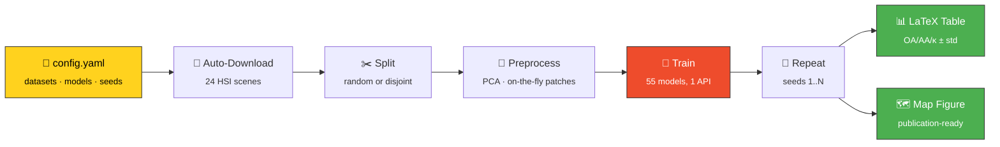

<div align="center">


### A PyTorch Library for Hyperspectral Image Models

[](https://python.org)
[](https://pytorch.org)
[](https://huggingface.co/datasets/Tanishq165/HSI_Datasets)
[](LICENSE)


<br>

**Benchmark 55 hyperspectral models across 24 datasets — from a single YAML file.**

**⚡ Fast to start · 🪶 Memory-efficient · 🔁 Reproducible**

<sub>CNN · Transformer · Mamba/SSM · Graph · KAN · Self-Supervised</sub>

</div>

```bash
pip install -r requirements.txt   # install
python main.py                    # train, evaluate, and write results
```

---

## ✨ Highlights

- 🧠 **Large model inventory:** 55 architectures from 2017–2026, across six families (CNN, Transformer, Mamba/SSM, Graph, KAN and self-supervised), all behind one API.
- 🌍 **24 benchmark scenes:** Airborne, Spaceborne, UAV and Mars CRISM data, downloaded from HuggingFace on first use and cached after that.
- 🪶 **Memory-efficient data loading:** a typical HSI pipeline extracts every patch up front and holds them all in RAM. This library keeps one normalised cube plus a list of patch positions, and cuts each patch on the fly when the model asks for it. Large scenes stay light on memory.
- ⚡ **Faster to start:** since nothing is pre-extracted, there is no slow patch-building step before training begins. Datasets are cached after the first download, so later runs skip it.
- 🧪 **Proven at scale:** 1,320 model–scene evaluations over 6,600 seeded runs in the [technical report](https://arxiv.org/abs/2609.39871).
- 🛡️ **Leak-aware splits:** class-balanced random splits, or a spatially disjoint split that draws train, validation and test samples from separate regions of the scene.
- 🔁 **Reproducible by default:** seeds are fixed across Python, NumPy, PyTorch, CUDA and cuDNN, and every run saves its own `config.yaml` snapshot.
- 📊 **Paper-ready output:** LaTeX OA/AA/κ tables (mean ± std) and arranged classification-map figures.

---

## 🔬 How It Works



<div align="center"><sub><i>One config in — comparable numbers and paper figures out.</i></sub></div>

---

## 💡 Why This Exists

Comparing HSI models usually means cloning a dozen repos, each with its own data loader, split logic, and training loop — and then comparing numbers that were never produced the same way. This framework puts **55 models (2017–2026) behind one interface**, on **24 auto-downloaded datasets**, with a shared split protocol and seeded repeated runs, so every model is measured under identical conditions.

|  |  |
|---|---|
| 🧠 **55 models** | CNN · Transformer · Mamba/SSM · Graph · KAN · self-supervised — [full zoo →](docs/MODELS.md) |
| 📦 **24 datasets** | Auto-downloaded from HuggingFace on first use — [details →](docs/DATASETS.md) |
| 🪶 **Low RAM** | Patches are sliced on the fly instead of pre-extracted and held in memory |
| ⚙️ **One config** | Datasets, models, splits, preprocessing, training, figures — all in one YAML |
| 🔁 **Repeated runs** | Explicit per-run seeds; results reported as mean ± std, not a single run |
| 📊 **Paper-ready** | LaTeX OA/AA/κ tables and arranged classification-map figures, generated for you |
| 📐 **Complexity** | Params and FLOPs for every model under a fixed probe input |

---

## ⚡ Quick Start

**1. Install** — PyTorch first, matched to your CUDA version:

```bash
git clone https://github.com/Tanishq251/Hyperspectral-Image-Models.git
cd Hyperspectral-Image-Models
conda create -n hsi python=3.10 -y && conda activate hsi

pip install torch==2.4.0 --index-url https://download.pytorch.org/whl/cu121
pip install -r requirements.txt             # core
pip install -r requirements-optional.txt    # + optional per-model extras
```

<details>
<summary><b>Mamba / SSM models need one extra step</b></summary>

<br>

`mamba_ssm` compiles CUDA kernels and can't be resolved as a plain wheel:

```bash
pip install "causal-conv1d>=1.4.0" --no-build-isolation
pip install "mamba-ssm>=2.2.2"     --no-build-isolation
```

These kernels have **no CPU fallback** — Mamba-family models require a GPU. Every other model works without them; a model whose dependency is missing is skipped with a warning rather than breaking the run.

</details>

**2. See what's available:**

```bash
python main.py --list-models      # 55 models
python main.py --list-datasets    # 24 datasets
```

**3. Edit `config/config.yaml`** — the three lines that matter:

```yaml
dataset:
  names: ["Salinas", "Pingan"]              # what to run on
model:
  name: ["SpectralFormer", "MambaHSI"]      # what to compare
data_split:
  seeds: [1, 2, 3]                          # → mean ± std over 3 runs
```

**4. Run, then build the table:**

```bash
python main.py                     # train everything in the config
python main.py --arrange-scores    # → LaTeX table, mean ± std
python main.py --arrange-only      # → arranged classification-map figure
```

That's the whole loop. Results land in `{results.directory}/{dataset}/{model}/run_{N}/`, each with its own config snapshot, so any number can be traced back to what produced it.

---

## 📖 Documentation

| Guide | What's in it |
|---|---|
| 🧠 [**Model Zoo**](docs/MODELS.md) | All 55 models by family, with paper, venue, year and official code |
| 📦 [**Datasets**](docs/DATASETS.md) | All 24 scenes — dimensions, bands, classes, sensors, config keys |
| ⚙️ [**Configuration**](docs/CONFIG.md) | Every setting explained, plus reproducibility and protocol notes |
| 🧰 [**Codebase Guide**](docs/CODEBASE.md) | Repository map, utilities, all commands, output layout |
| ➕ [**Adding a Model**](docs/CONTRIBUTING.md) | Drop in one file — the registry finds it |

---

## 🔍 At a Glance

<details>
<summary><b>🧠 The 55 models by family</b></summary>

<br>

| Family | Count | Models |
|---|:--:|---|
| **Transformer** | 16 | SpectralFormer · MFT · GAHT · MASSFormer · MorphFormer · SSFTTNet · CTMixer · 3DConvSST · DBCTNet · DSFormer · HSIC_SClusterFormer · MMFormer · GSCViT · S2Gformer · MVAHN · FAHM |
| **Mamba / SSM** | 20 | MambaHSI · MambaHSI_Plus · SSMamba · S2Mamba · WaveMamba · MiM · PHDMamba · IGroupSS-Mamba · HyPyraMamba · MLFMamba · MambaMoE · HyperMamba · MambaLG · MorpMamba · MHSSMamba · ConvVitMamba · EMamba · FuzzySpectralMamba · GraphMamba · R2Mamba |
| **CNN** | 10 | SSRN · HybridSN · pResNet · DBDA · ENL_FCN · SACNet · SSTN · S3ANet · FETNet · DKDMN |
| **Graph / GCN** | 4 | GraphGST · MCTGCL · GTCFN · MS2GCAN |
| **KAN** | 2 | HyperKAN · HSIConvKAN |
| **Self-supervised** | 3 | HSIMAE · LFSMIM · HSIC_FM |

Full table with papers and code links → [docs/MODELS.md](docs/MODELS.md)

</details>

<details>
<summary><b>📦 The 24 datasets</b></summary>

<br>

**Classic benchmarks** — Indian Pines · Pavia University · Pavia Center · Salinas · KSC · Botswana
**Urban / fusion** — Houston 2013 · Houston 2018 · Berlin · Augsburg · Trento · MUUFL
**WHU-Hi (UAV)** — HanChuan · HongHu · LongKou
**QUH (UAV, Qingdao)** — Pingan · Qingyun · Tangdaowan
**HyRANK (Greece)** — Dioni · Loukia
**Other** — Chikusei
**Planetary (Mars, CRISM)** 🪐 — Holden · NiliFossae · Utopia

All auto-downloaded from [🤗 Tanishq165/HSI_Datasets](https://huggingface.co/datasets/Tanishq165/HSI_Datasets). Sizes, bands, classes and sensors → [docs/DATASETS.md](docs/DATASETS.md)

</details>

<details>
<summary><b>📁 What a run produces</b></summary>

<br>

```
{results.directory}/{dataset}/{model}/
├── run_1/
│   ├── best_model.pth          # best checkpoint by validation metric
│   ├── config.yaml             # exact config used for this run
│   ├── training_log.csv        # epoch-level log
│   └── classification_map.png  # if visualization is enabled
├── run_2/ …
└── results_summary.csv         # OA / AA / κ aggregated across runs
```

</details>

---

## 🔁 Reproducibility

Three config-level settings control how reproducible a comparison is:

- **`data_split.seeds: [1, 2, 3]`** — explicit seeds, one per run. The same list across models means every model sees *identical* splits.
- **`training.num_runs`** — repeats; `--arrange-scores` reports mean ± std rather than a best run.
- **Fixed protocol** — hold `patch_size`, `num_pca_bands` and `split_samples` constant across the models you compare, and report them. They move results more than most architectural differences.

Every run writes its own `config.yaml` snapshot, so results are always traceable. Full notes → [docs/CONFIG.md](docs/CONFIG.md)

---

## 📄 Citation

If this framework is useful in your research, please cite it — and the original paper of every model and dataset you use ([links here](docs/MODELS.md)).

```bibtex
@misc{rachamalla2026hsi,
      title={A PyTorch Library For Hyperspectral Image Models: Technical Report}, 
      author={Tanishq Rachamalla and Aryan Das and Srishti Kaushik and Swalpa Kumar Roy},
      year={2026},
      eprint={2609.39871},
      archivePrefix={arXiv},
      primaryClass={cs.CV},
      url={https://arxiv.org/abs/2609.39871}, 
}
```

---

## 📚 Related Work

Other hyperspectral research from the same authors:

| Project | What it is | Links |
|---|---|:--:|
| **HyperCap** | The first large-scale hyperspectral **captioning** dataset — pairs spectral data with pixel-wise textual annotations for vision-language models | [](https://arxiv.org/abs/2505.12217) [](https://github.com/arya-domain/HyperCap) |
| **SM-HAD** | Spectrum Mamba for hyperspectral **anomaly detection** — an encoder–decoder state-space model with linear-complexity long-range modelling | [](https://www.researchgate.net/publication/403070039_SM-HAD_Spectrum_Mamba_for_Hyperspectral_Anomaly_Detection) [](https://github.com/Tanishq251/SM-HAD) |
| **HSI Datasets** | The 24-scene collection this framework downloads from — ~20.1 GB, Apache 2.0 | [](https://huggingface.co/datasets/Tanishq165/HSI_Datasets) |

---

## 🙏 Acknowledgements

Every model here is a re-implementation of published work — all architectural credit belongs to the original authors, whose papers and reference code are linked in the [Model Zoo](docs/MODELS.md). Datasets are credited to NASA JPL/AVIRIS, Wuhan University, IEEE GRSS, University of Pavia, NASA MRO CRISM, DLR/HyMap, Ocean University of China (QUH) and the University of Southern Mississippi.

## ⚖️ License

[Apache 2.0](LICENSE). Individual model implementations remain subject to the licensing terms of their original repositories.

## 📬 Contact

**Bugs, features, dataset questions** — [GitHub Issues](https://github.com/Tanishq251/Hyperspectral-Image-Models/issues) · [HuggingFace Discussions](https://huggingface.co/datasets/Tanishq165/HSI_Datasets/discussions)

**Reach the authors directly:**

| Author | Email |
|---|---|
| Tanishq Rachamalla | [tanishqrachamalla12@gmail.com](mailto:tanishqrachamalla12@gmail.com) |
| Aryan Das | [aryandas156@gmail.com](mailto:aryandas156@gmail.com) |
| Srishti Kaushik | [kaushiksrishti108@gmail.com](mailto:kaushiksrishti108@gmail.com) |
| Swalpa Kumar Roy | [swalpa@tezu.ernet.in](mailto:swalpa@tezu.ernet.in) |

---

<div align="center">

*Built with ❤️ for the hyperspectral remote sensing community*

</div>
